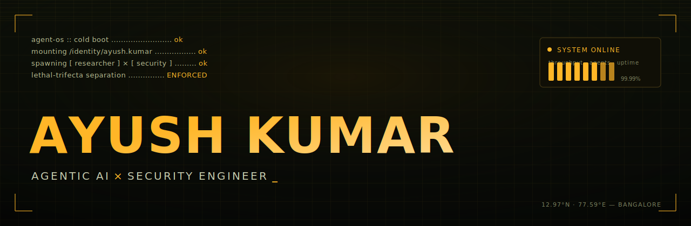
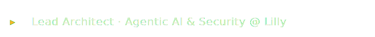
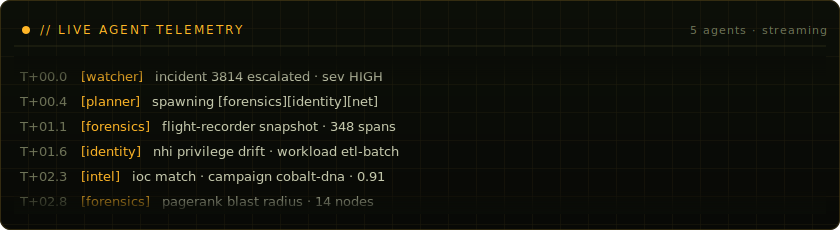
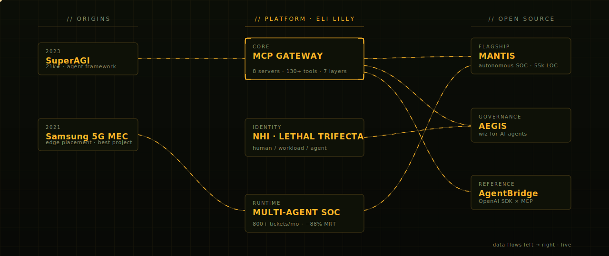

<!-- ============================================================
  COLONAYUSH · GitHub profile README
  agent-os console · amber phosphor · hand-built animated SVGs
  Asset source lives in this repo's /assets folder.
============================================================ -->

<div align="center">



<br/>



<br/><br/>

<a href="https://linkedin.com/in/colonayush"></a>
<a href="https://ayushkai.vercel.app"></a>
<a href="mailto:ayushkaps9462@gmail.com"></a>
<a href="https://doi.org/10.5281/zenodo.19161532"></a>
<a href="https://x.com/"></a>

<br/>


&nbsp;


</div>


### &nbsp;


> I build the runtime where **AI agents** do real work inside real enterprises — without leaking secrets, hallucinating into prod, or holding more autonomy than a junior analyst would.

I'm a **Lead Architect for Agentic AI & Security at Eli Lilly** — one half AI researcher, one half security engineer, most days both before lunch. I designed Lilly's enterprise **MCP gateway** (8 servers, 130+ AI-callable tools, 7 layers of defense), authored its **Agentic Identity (NHI) Framework**, and ship a four-tier multi-agent platform that autonomously resolves **800+ tickets a month**. Before Lilly I was a **founding engineer at SuperAGI** (21k★), and a **Samsung Research** intern optimizing 5G mobile-edge placement.

Now I'm open-sourcing what I learned: **MANTIS**, **AEGIS**, and **AgentBridge**.


```log
[ now ] AEGIS         · runtime governance for agents — the "Wiz for AI agents"
[ now ] AgentBridge   · OpenAI Agents SDK × MCP reference toolkit
[ now ] MANTIS v2     · federated TI · stronger differential privacy · AI self-defense
[ now ] writing       · a series for founders: prototype → production, safely
[ open ] conversations with AI labs, security teams & founders building agentic products
```

<div align="center"></div>


### &nbsp;


#### &nbsp;&nbsp;▸ MANTIS — Multi-Agent Autonomous Threat Intelligence &nbsp; `flagship · open source`

An open-source autonomous SOC: **12-engine parallel detection** (ViT, BERT, transformer log-anomaly, DGA, UEBA, Sigma) fused by weighted confidence, a **ReAct investigation agent** with 15 tools and multi-LLM consensus, and a **reinforcement-learning response engine** (PPO/DQN). 55K LOC · 130+ API endpoints · 2,100+ tests. Presented at **BSides Bangalore 2025** — selected as **NullCon AI Paper of the Year**.

<a href="https://github.com/COLONAYUSH/Project-MANTIS"></a>
<a href="https://doi.org/10.5281/zenodo.19161532"></a>

| project | what it is | status |
| :--- | :--- | :--- |
| **AEGIS** | Runtime governance for AI agents — behavioral fingerprinting, NHI credential-drift alerts, multi-agent trust protocol with cryptographic attestation, decision flight recorder, OWASP-Agentic-10 continuous scoring. | `building · private` |
| **AgentBridge** | OpenAI Agents SDK × MCP reference — eval harness, OTel observability, guardrails, per-session credential isolation. | `building` |
| **CyberWay** | Lilly-wide standard for security-first AI connectors — tool-level RBAC, HITL gateways, NHI lifecycle, SOX audit logging. | `internal standard` |
| **[SuperAGI](https://superagi.com)** | Founding engineer — autonomous agent framework. 21k★ · 15k+ developers. Architected Supercoder + Contlo.ai plugin layer. | `open source` |
| **[MEC Server Placement](https://github.com/COLONAYUSH/MEC-Server-Placement)** | Samsung Research — ML for 5G mobile-edge server placement & scheduling. 30+ servers → 11. Best Project. | `open source` |


<div align="center"></div>


### &nbsp;


<div align="center">


</div>

<div align="center">

</div>

<div align="center">

</div>

<!-- snake contribution graph — generated by the Action in .github/workflows/snake.yml -->
<div align="center">

</div>

<details>
<summary>&nbsp;<code>$ git log --oneline --since=1.week</code> &nbsp;— recent activity (auto-updated daily)</summary>

<!--START_SECTION:activity-->
<!--END_SECTION:activity-->

</details>


### &nbsp;


- **Autonomous Adversarial Threat Detection Agent** — BSides Bangalore 2025 · **NullCon AI Paper of the Year**. [`DOI 10.5281/zenodo.19161532`](https://doi.org/10.5281/zenodo.19161532)
- **CyberWay — Enterprise AI Connector & Agent Standard** — Eli Lilly · adopted across all Cybersecurity teams.
- **Optimal 5G Mobile Edge Server Placement & Task Scheduling** — Samsung Research · Certificate of Excellence (Best Project).


| year | recognition | scope |
| :--- | :--- | :--- |
| 2025 | **NullCon AI Paper of the Year** | Autonomous Adversarial Threat Detection Agent |
| 2024 | **Rising Star Award** — Eli Lilly | among 10,000+ employees |
| 2022 | **LiFT Scholar** — The Linux Foundation | 50 individuals globally |
| 2022 | **AWS DeepRacer** | ranked **23rd** globally |
| 2021 | **Certificate of Excellence** — Samsung Research | Best Project · 5G MEC |
| 2020 | **HPAIR Representative** — Harvard | India delegation |


### &nbsp;


**Languages**
<br/>
     

**Agentic AI**
<br/>
       

**LLM & ML**
<br/>
     

**Cloud & Platform**
<br/>
       

**AI Security**
<br/>
      

**Data & Observability**
<br/>
     


### &nbsp;


<div align="center">

Building something **agentic**? Securing one? I'm a few keystrokes away.

<a href="https://linkedin.com/in/colonayush"></a>
<a href="https://ayushkai.vercel.app"></a>
<a href="mailto:ayushkaps9462@gmail.com"></a>

<br/>

<sub>`agent-os` · built by Ayush Kumar · lethal-trifecta separation enforced · © 2026</sub>

</div>
