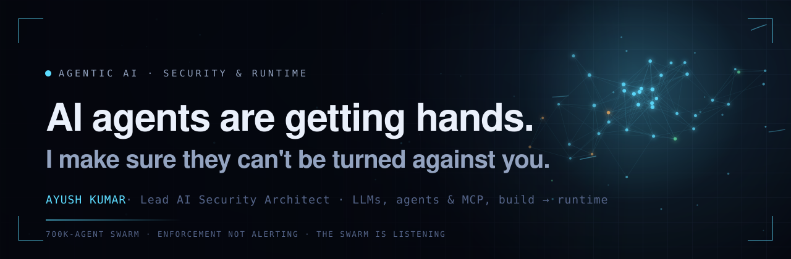
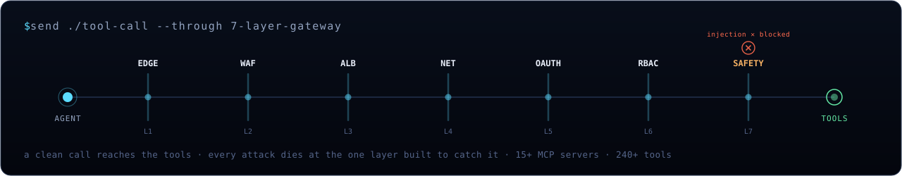
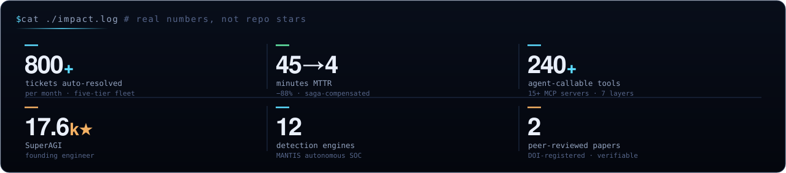

<!-- ============================================================
  COLONAYUSH · GitHub profile
  SWARM console — deep-space void · cyan swarm · mono voice.
  Brand-matched to the portfolio (ayushsec.vercel.app).
  Hand-built animated SVGs live in /assets (generated, self-contained).
============================================================ -->

<div align="center">



<br/>

<a href="https://ayushsec.vercel.app"></a>
<a href="https://www.linkedin.com/in/ayush-kumar-0357b5190/"></a>
<a href="https://doi.org/10.5281/zenodo.19161532"></a>
<a href="https://ayushsec.vercel.app/assets/Ayush-Kumar-Resume.pdf"></a>
<a href="mailto:ayushkaps9462@gmail.com"></a>

<br/><br/>


&nbsp;


</div>


### &nbsp;


> I build the runtime where **AI agents** do real work inside real enterprises — without leaking secrets, hallucinating into prod, or holding more autonomy than a junior analyst would.

Agentic-AI security engineer and **lead AI security architect**. I secure **LLMs, agents, and MCP from build to runtime**, at enterprise scale — and I've been building agents since before securing them was a job.

I designed a **company-wide MCP security architecture** (15+ servers · 240+ agent-callable tools · **7 enforced layers** of defense-in-depth), authored an **Agentic Identity (NHI) framework** whose core control makes prompt-injection exfiltration an *architectural impossibility, not an alert*, and run a **five-tier agent fleet** that autonomously resolves **800+ tickets/month** — cutting MTTR from **45 min → 4**. Earlier: **founding engineer at SuperAGI** (17.6k★, tens of thousands of developers) and an **AI R&D intern at Samsung Research**.

Now I'm open-sourcing what I learned: **MANTIS**, **AEGIS**, and **ARGUS**.


```log
[ shipping ]  AEGIS    ·  "Wiz for AI agents" — flight recorder + agent EDR + identity plane
[ shipping ]  ARGUS    ·  drop-in MCP proxy — re-validates every tool call at runtime, not install
[ research ]  frontier ·  4 runtime detectors for machine-speed autonomous actors (GTG-1002 class)
[ writing  ]  memoranda·  field notes from the runtime — the lethal trifecta, forensics, governance
[ open     ]  conversations with AI labs, security teams & founders building agentic products
```


### &nbsp;


#### &nbsp;&nbsp;▸ MANTIS &nbsp;·&nbsp; Multi-Agent Autonomous Threat-Intelligence &nbsp; `flagship · award-winning`

An autonomous SOC: **12 heterogeneous detection engines** (ViT, BERT, transformer log-anomaly, DGA, UEBA, Sigma…) fused by weighted-confidence consensus, a **ReAct investigation agent** with 15 tools under mandatory multi-LLM agreement, and a **reinforcement-learning response engine** (PPO/DQN) over a PageRank risk graph. **~55K LOC · 130+ API endpoints · 2,100+ tests.** Presented at **BSides Bangalore** · **NullCon AI Paper of the Year 2025**.

<a href="https://mantis-site.vercel.app"></a>
<a href="https://doi.org/10.5281/zenodo.19161532"></a>

<div align="center"></div>

| project | what it is | status |
| :--- | :--- | :--- |
| **AEGIS** | Runtime governance for agents — tamper-evident WORM flight recorder + deterministic replay, an agent EDR with calibrated-null detectors, and a SPIFFE/SPIRE identity plane scoring exposure against the OWASP Agentic Top-10. | `open source · pre-release` |
| **ARGUS** | Drop-in MCP proxy that re-validates every tool call at runtime — signed-tool registry, OPA/Rego policy, default-deny — closing the install-time trust gap that rug-pull (MCPoison / CVE-2025-54136) attacks exploit. | `open source · pre-release` |
| **Agentic Identity (NHI)** | Per-agent identities + 15-min JIT credentials + the *Lethal-Trifecta Separation* invariant: no context ever holds untrusted input, live credentials, and mutation power at once. | `in production` |
| **Agent Forensics** | Halpern-Pearl actual causality applied to agent traces — *which* action was the actual cause, and *who* is answerable. Mapped to EU AI Act Art. 12/72. | [`paper · DOI`](https://doi.org/10.5281/zenodo.20698154) |
| **[SuperAGI](https://superagi.com)** | Founding engineer — autonomous-agent framework. **17.6k★ · 2.2k forks.** Built the orchestration loop, tool-integration boundary, and memory modules. | `open source` |
| **[MEC Server Placement](https://github.com/COLONAYUSH/MEC-Server-Placement)** | Samsung Research — ML for 5G mobile-edge placement & scheduling. 30+ servers → 11. Best Project. | `published` |


### &nbsp;


```toml
languages   = "Python · TypeScript · Go · Rust · SQL · Bash"
agentic     = "Claude Agent SDK · OpenAI Agents SDK · LangGraph · CrewAI · MCP · A2A · ReAct"
security    = "OWASP LLM & Agentic Top-10 · MITRE ATLAS · NIST AI RMF · ISO 42001 · EU AI Act"
red-team    = "PyRIT · Garak · Promptfoo · LLM-as-a-judge · DeepEval · Ragas"
runtime     = "AWS Bedrock/ECS/Fargate · Temporal · OpenTelemetry · SPIFFE/SPIRE · OPA/Rego"
ml + data   = "PyTorch · HuggingFace · RL (PPO/DQN) · RAG + Graph-RAG · vector stores"
sec-ops     = "Splunk · CrowdStrike · Cortex XSOAR · Cloudflare · Wiz · Entra workload identity"
```


### &nbsp;


- **Tamper-Evident ≠ Trustworthy** — forensically-sound attribution of autonomous-agent actions (Halpern-Pearl causality × EU AI Act). &nbsp;[`DOI 10.5281/zenodo.20698154`](https://doi.org/10.5281/zenodo.20698154)
- **Autonomous Adversarial Threat-Detection Agent** (MANTIS) — BSides Bangalore · NullCon AI Paper of the Year 2025. &nbsp;[`DOI 10.5281/zenodo.19161532`](https://doi.org/10.5281/zenodo.19161532)
- **Writing** — a growing set of technical memoranda on agent security, written from the runtime rather than the podium. &nbsp;[`read →`](https://ayushsec.vercel.app/research/)


`NullCon AI Paper of the Year 2025`  ·  `AWS DeepRacer #23 global`  ·  `Linux Foundation LiFT Scholar (1 of 50)`  ·  `HTB Certified Offensive AI Expert`  ·  `Azure Red Team (Advanced)`  ·  `Splunk Certified Admin`

> **Proof over claims.** Everything here is checkable — two DOI-registered papers, a live autonomous SOC, an open portfolio, and a résumé hashed live with SHA-256. The runtime does not take my word for it, and neither should you.


### &nbsp;



### &nbsp;


<div align="center">

**The swarm is listening.** &nbsp; If you're building agentic products — or defending them — let's talk.

<a href="https://ayushsec.vercel.app"></a>
<a href="https://www.linkedin.com/in/ayush-kumar-0357b5190/"></a>
<a href="mailto:ayushkaps9462@gmail.com"></a>
<a href="https://ayushsec.vercel.app/assets/Ayush-Kumar-Resume.pdf"></a>

<sub><code>agentic AI · security · runtime</code> &nbsp;·&nbsp; built &amp; secured from build to runtime</sub>

</div>
